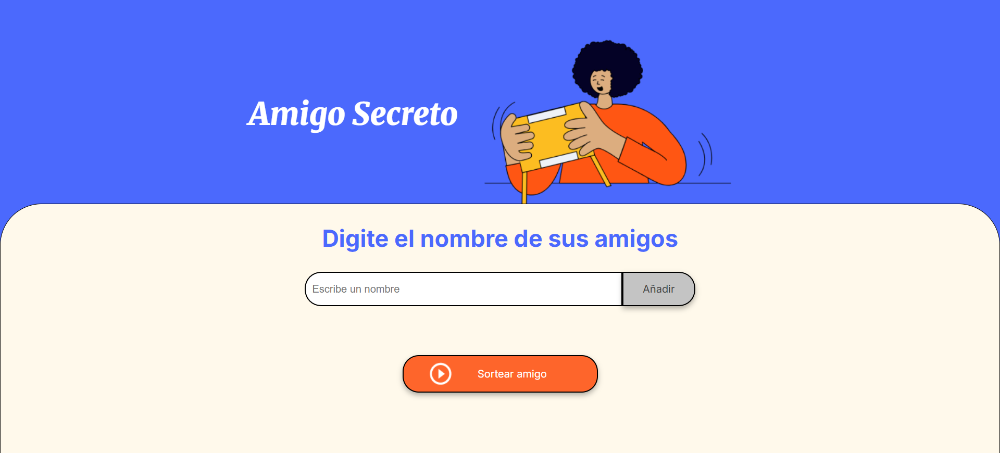

# Sorteo Amigo Secreto


Aplicación web 🌐 para realizar sorteos de 'Amigo Secreto' 🎁🎉 entre amigos 👥.
Permite agregar nombres ➕📝, visualizarlos en una lista 📋👀 y realizar un sorteo aleatorio 🎲🎯.

## Características

* **Agregar Nombres** ➕📝👥 (Botón para añadir amigos)
* **Validación** ❌⚠️✅ (Evitar nombres vacíos)
* **Visualización** 📋👀🧑‍🤝‍🧑 (Lista de nombres ingresados)
* **Sorteo Aleatorio** 🎲🎁🎉 (Elección del amigo secreto)

## Tecnologías

- ⚡ **HTML**: Estructura de la página.
- 🎨 **CSS**: Estilo y diseño responsivo.
- 💻 **JavaScript**: Lógica para agregar, sortear y reiniciar.
  
## Capturas de Pantalla



**Interfaz principal de la aplicación 🖥️🎁**

## Uso

* 1️⃣ Agrega nombres ✍️ en el campo de texto.
* 2️⃣ Haz clic en ➕ ```Añadir``` para incluirlos en la lista.
* 3️⃣ Haz clic en 🎲 ```Sortear amigo``` para elegir al azar.
